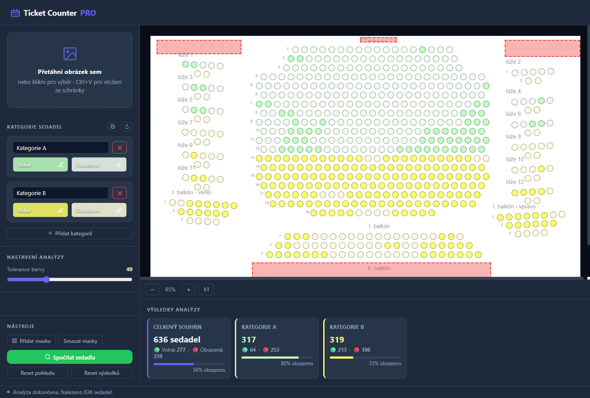

# Ticket Counter PRO

**Ticket Counter PRO** je klientská webová aplikace (Single Page Application bez nutnosti backendu) pro automatizované počítání volných a obsazených sedadel ze snímků hledišť, nákresů a online mapek sálových rezervací. Aplikace plně poběží ve vašem prohlížeči, čímž zajišťuje maximální rychlost a zachování soukromí (žádná data se nikam neodesílají).

---

## 🔥 Hlavní funkce

- 🚀 **Rychlá analýza obrazu**: Bleskové zpracování obrazu přímo v prohlížeči bez nutnosti nahrávání na server. 
- 🗂️ **Neomezené kategorie**: Možnost vytvářet rozličné kategorie pro různé cenové relace či sektory. 
- 💉 **Přesné kapátko (Nástroj lupy)**: Nastavení barev z konkrétních bodů mapky je usnadněno fixní obrazovkovou lupou (160x160 px), ve které na pixel přesně zaměříte cílené odstíny pomocí výrazného středového kříže.
- ⬜ **Vylučovací Masky**: Můžete flexibilně nadefinovat neomezené množství prostorových masek (vynechaných zón), které zajistí, aby detekční algoritmus ignoroval např. textové bloky nebo legendy překrývající sedačky.
- 💾 **Šablony kategorií**: Snadné uložení vaší struktury kategorií pro pozdější použití na stejném prohlížeči (pomocí `localStorage`).
- 📁 **Pohodlné vstupy**: Natažení vstupního obrázku přes Drag & Drop, kliknutím nebo jednoduchým vložením ze schránky (`Ctrl+V`).

## 🛠️ Jak to funguje pod kapotou?
Po odeslání do fronty se na nahraný obrázek aplikuje:
1. **Barevná filtrace:** Odfiltrování neplatných barev.
2. **Breadth-First Search (BFS):** Algoritmus sjednotí jednobarevné pixely do clusterů i v místech, kde je uvnitř sedadla číslo (přerušená obrysová hrana).
3. **Non-Maximum Suppression (NMS):** Chytré odstranění duplicit a zajištění vizuálního zarovnání výsledných kroužků u obřích obrázků podle mediánu ploch všech sedaček. 

---

## 🏃 Jak aplikaci spustit

Aplikace se zkládá z pouhého jediného `HTML` plně se samonosným `CSS` i `JS`. 

1. Stáhněte si tento repozitář (nebo přímo samotný soubor `ticket-counter-pro.html`).
2. Otevřete `ticket-counter-pro.html` v libovolném moderním webovém prohlížeči (podpora pro Google Chrome, Mozilla Firefox, Edge, Safari).
3. *Nepotřebujete Node.js, Python server ani žádný jiný lokální dev-server.*

## 🎬 Ukázka práce

*(Zde vložte screenshot aplikace po dokončení analýzy obarvených zón)*

## 🕹️ Návod na použití

1. **Vstup**: Stiskněte `Ctrl+V` (nebo vložte soubor myší) pro nahrání rezervačního grafu.
2. **Definice Třídy**: V *Kategorii sedadel* přiřaďte barvy volného a obsazeného stání pomocí tlačítka dané položky a vylepšenou přesnou kapátkovou utilitou.
3. **Masky (volitelné)**: Použijte „Přidat masku“ na potlačení výpočtů v oblastech, které nechcete skenovat (např. rušivé texty).
4. **Analýza**: Stiskněte na zelené tlačítko „**Spočítat sedadla**“. Výsledky i se statistickým panelem vyskočí ve spodní obrazovce a systém na mapě vizualizuje, kde zaznamenal hledané polohy.
